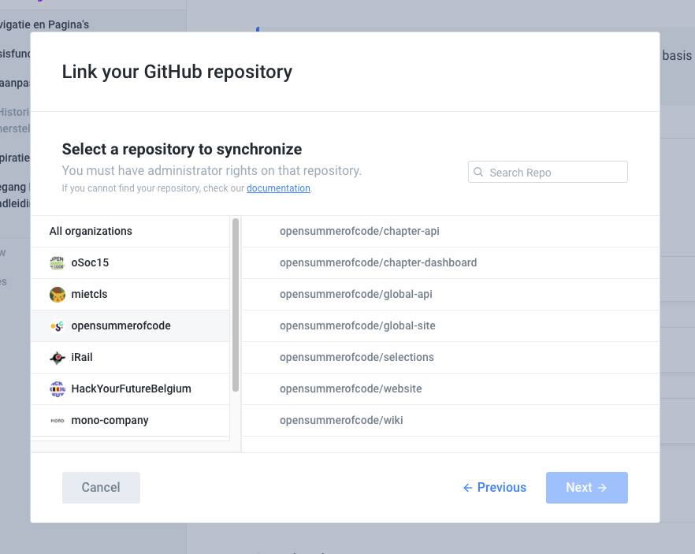

# Handleiding Gitbook voor Handleidingen

Deze handleiding bestaat om mensen binnen ABB te ondersteunen bij het delen van informatie over _open source_ producten. Ben je niet zeker of GitBook iets voor jou is? Bezoek de [Waarom en voor wie](waarom-en-voor-wie.md) pagina.

## Belangrijk om te weten​


Dit is een korte handleiding over hoe Gitbook te gebruiken in Het Nederlands, met de meest belangrijke functionaliteiten uitgelegd. Een uitgebreide versie in het Engels kan je hier vinden: [https://docs.gitbook.com/](https://docs.gitbook.com/)


De belangrijkste functionaliteiten kan je terugvinden op deze pagina's:







_Meer informatie nodig? Mail naar_ [_miet@miet.be_](mailto:miet@miet.be) _en ik help je verder!_

## Bewerkingsrecht krijgen



## Inspiratie

Raak geïnspireerd door andere handleidingen



## Printen

Je kan elke pagina exporteren als PDF; moest dat ooit nodig zijn. Wil je meer controle over de layout? Gebruik de print-functionaliteit via je browser, en pas daar de interlinie, koppen en voeten aan. 

## Source Code op Github

We kunnen alle informatie, die we schrijven in deze handleidingen, linken aan een GitHub repository. Op deze manier omzeilen we vendor lock-ins, en zorgen we ervoor dat de informatie niet zoek geraakt moest Gitbook plots niet meer bestaan.

## Is Gitbook gratis?

Omdat onze producten [open source zijn, is Gitbook gratis](https://docs.gitbook.com/pricing/plans) voor ons. Dat staat gelijk aan een [Business plan](https://docs.gitbook.com/pricing/plans#business-plan).

## Is Gitbook toegankelijk?

We zijn momenteel de gegenereerde pagina's aan het screenen. 

