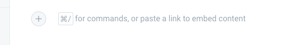
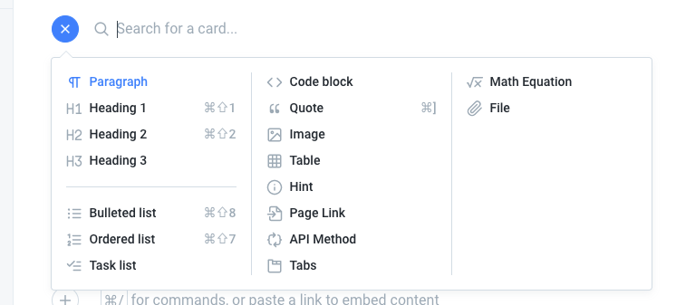
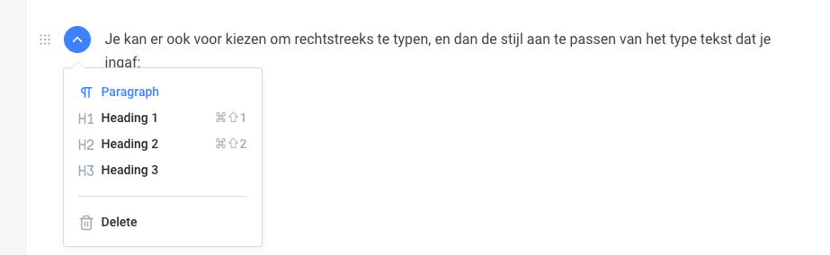
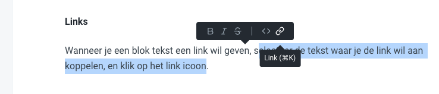
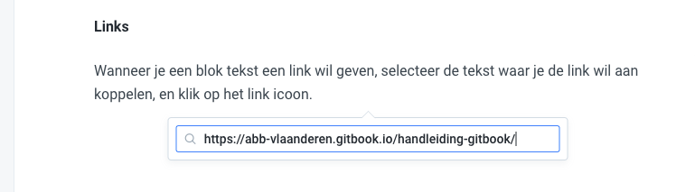
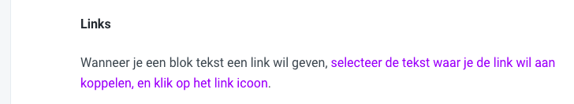
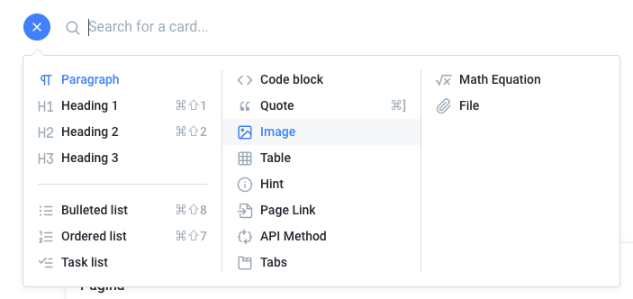
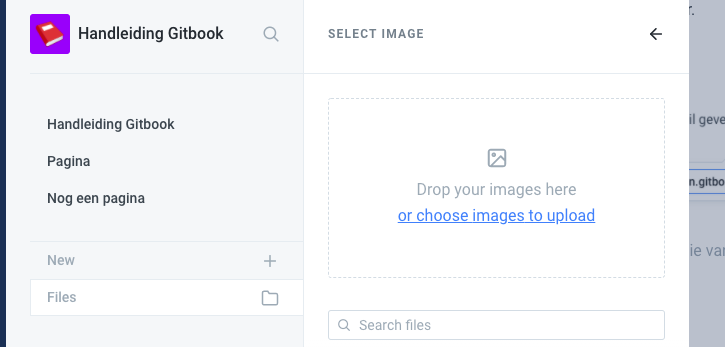

# Basisfunctionaliteiten

Bij het aanmaken van een nieuwe pagina, heb je verschillende manieren om inhoud toe te voegen:

## Informatie toevoegen

### Template kiezen

Wanneer je start van een nieuwe pagina, kan je ervoor kiezen om met een template te starten.

### "Kaartjes" of informatieblokken toevoegen

Klik op de handleiding om informatie in te voegen. Dan verschijnt er een plusje, waar je kan kiezen wat voor informatie je toevoegt.

Je kan er ook voor kiezen om rechtstreeks te typen, en dan de stijl aan te passen van het type tekst dat je ingaf:

Zorg er in dit geval zeker voor dat je headings _semantisch_ goed gebruikt, en headings in de juiste hiërarchie gebruikt \(dus geen H3 na een H1 bijvoorbeeld!\).

## Links toevoegen

### Links

Wanneer je een blok tekst een link wil geven, [selecteer de tekst waar je de link wil aan koppelen, en klik op het link icoon](https://abb-vlaanderen.gitbook.io/handleiding-gitbook/).

Geef vervolgens de link in en druk op enter.

## Afbeeldingen toevoegen

Afbeeldingen kan je gewoon droppen waar je cursor staat in de editor, of via het plusje toevoegen:

