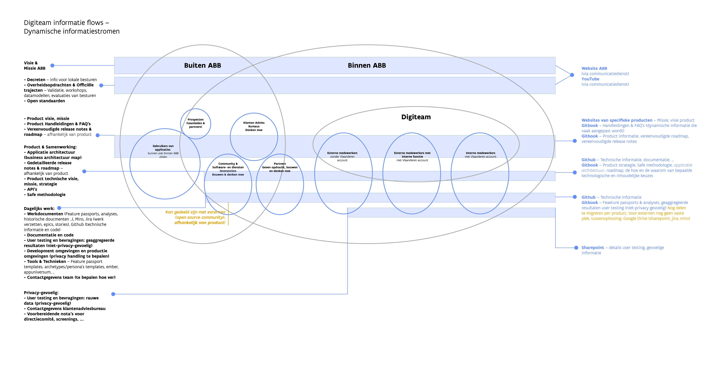
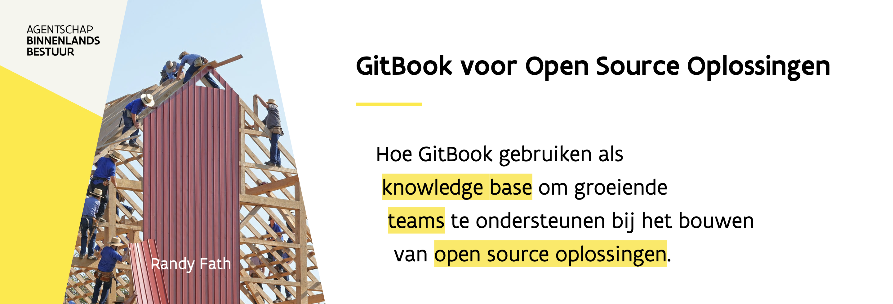

# Zet je eigen GitBook omgeving op

## Mogelijkheden van informatie delen

Onderaan zie je een visuele representatie van de informatiestromen, naar wie deze moeten en waar deze horen. Vind meer informatie over [welke informatie voor wie](../waarom-en-voor-wie/voorbeelden-van-informatie-delen.md) en [waar je informatie kwijt kan](../waarom-en-voor-wie/voorbeelden-van-informatie-delen.md).

## Is GitBook iets voor jou?

Gebruik deze beslissingsboom om te ontdekken of GitBook iets voor jouw team is. Betere voorbeelden nodig? Gebruik[ voorbeelden van informatie delen](../waarom-en-voor-wie/voorbeelden-van-informatie-delen.md).

{% embed url="https://www.figma.com/file/qweKK3x3NmwDiCtK7ZcrDk/Applicatiearchitectuur-ABB?node-id=2723%3A0" %}

Neem contact op met het Digiteam om een eigen space op te zetten, of om meer informatie te krijgen.

