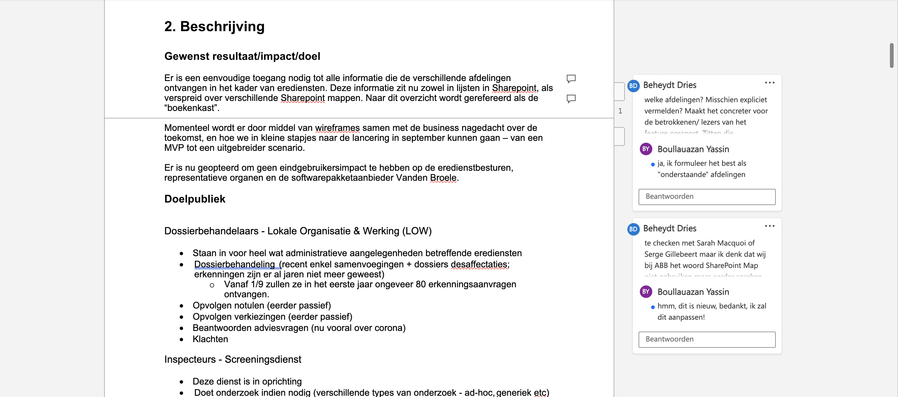
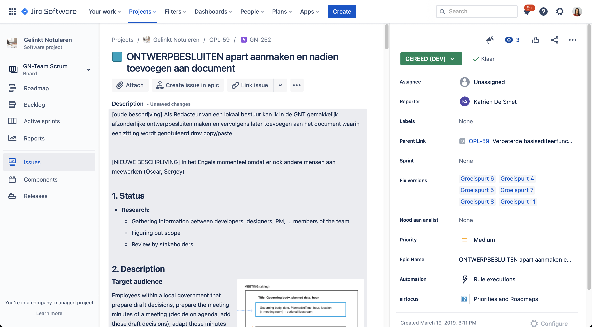

# Andere Systemen


in progress


## De zoektocht naar een flexibel documentbeheersysteem

Voor we met GitBook startten, hebben we een onderzoek gedaan naar verschillende documentbeheersystemen die ons konden ondersteunen bij het delen van kennis. Tijdens de pandemie werd het heel erg duidelijk dat we veel informatie deelden tijdens meetings, afhankelijk waren van gesprekken op de gang – net op het moment dat we sterk moesten groeien.

We gingen op zoek naar een manier om eenvoudig kennis te delen op enkele manieren:

1. **Binnen het team** Zowel leden van het Digiteam binnen ABB als contracthouders
2. **Naar externen** De community die we willen uitbouwen om bij te dragen aan onze open source software, partners en leveranciers

Het onderstaande onderzoek is gedateerd aangezien dit vooral gekaderd was in een documentbeheersysteem – de noden die achteraf bevraagd werden \(te bekijken in [Welke informatie en voor wie](../welke-informatie-voor-wie.md), [Waarom en voor wie](../)\) hebben ons tot GitBook gebracht.

### Onderzochte Systemen

1. [Drive](kadering-binnen-documentbeheersysteem.md#drive)
2. [HTML & CSS \(eigen sites\)](kadering-binnen-documentbeheersysteem.md#html-and-css-eigen-sites)
3. [CMS systemen](kadering-binnen-documentbeheersysteem.md#cms-systemen)
4. [Sharepoint](kadering-binnen-documentbeheersysteem.md#sharepoint)
5. [Teams](kadering-binnen-documentbeheersysteem.md#teams)
6. [Jira epics](kadering-binnen-documentbeheersysteem.md#jira-epics)
7. [Wiki in GitHub](kadering-binnen-documentbeheersysteem.md#wiki-in-github)
8. [Confluence](kadering-binnen-documentbeheersysteem.md#confluence)
9. [GitBook](kadering-binnen-documentbeheersysteem.md#gitbook)

## Analyses

### Drive

_\[2019: ABB wil graag van Drive afstappen, dat nu naast Sharepoint draait. Vroeger systeem om met aannemers samen te werken\]_

#### Nadelen

* De manier waarop ze met data van organisaties en mensen omgaan ondersteunen we niet.
* Moeilijk om controle te houden over "wildgroei" van delen.
* Sharepoint heeft grotendeels dezelfde functionaliteiten.
* Geen gemakkelijke manier om informatie te vinden voor nieuwelingen, geen goed "startpunt"

#### Voordelen

* Gemakkelijker beheer dan Sharepoint; je kan documenten open delen, ook aan mensen die niet in onze werking zitten \(ook nadelig, zie vorige punten\).
* Eenvoudig inloggen op elk type laptop met elk type bestuurssysteem
* Gemakkelijk bewerken, intuïtief, alle features
* Ook te bewerken door mensen die niet technisch zijn

### HTML & CSS \(eigen sites\)

_Niet verder uitgewerkt door onderstaande nadelen._

#### Nadelen

* Niet aan te passen door mensen zonder technische achtergrond
* Moeilijk vlot samenwerken door technische bottleneck, moet allemaal via technisch team gaan.

#### Voordelen

* Hoge flexibiliteit en aanpasbaarheid
* Data is van ons, geen tracking

[https://loket.lokaalbestuur.vlaanderen.be/handleiding/](https://loket.lokaalbestuur.vlaanderen.be/handleiding/)

### CMS systemen

_Niet verder uitgewerkt door onderstaande nadelen._

#### Nadelen

* Hoge investering; zowel in tijd als middelen.

#### Voordelen

* Hoge flexibiliteit en aanpasbaarheid.
* Niet aan te passen door mensen zonder technische achtergrond.

### Sharepoint

#### Nadelen

* Problemen met machtigingen en verlopen van toegang \(alle externen\)
* Niet alle leden van Redpencil geraken er eenvoudig op
* Geen mogelijkheid om externe open source ontwikkelaars toegang te geven
* Geen gemakkelijke manier om informatie te vinden voor nieuwelingen, geen goed "startpunt"
* Links delen werkt vaak niet

#### Voordelen

* Gemakkelijk documenten beheren
* Meeste features om documenten te bewerken aanwezig \(afbeeldingen etc\)

### Teams

#### Nadelen

* Geen handig mappensysteem; er is geen hiërarchie, overzicht geraakt snel verloren
  * Geen gemakkelijke manier om informatie te vinden voor nieuwelingen, geen goed "startpunt"
* Afbeeldingen verdwijnen
* Niet alle ontwikkelaars kunnen er vlot aan
* Geen mogelijkheid om externe open source ontwikkelaars toegang te geven
* Links updaten niet automatisch, ook niet naar stories \(met plugin wel?\)
* Verhuizen van documenten kan niet eenvoudig
* Starten vanuit een template kan niet

#### Voordelen

* voldoende “screen estate”
* kan gedeeld worden
* inline comments bij de juiste onderdelen voor de juiste mensen
* zoeken is eenvoudiger dan in jira

### Jira epics

Uitgebreider onderzoek.

#### Nadelen

* Niet eenvoudig te editeren
  * editeerbalk blijft bovenaan staan, de hele tijd weer omhoog scrollen om iets aan te passen
  * afbeeldingen in context zijn moeilijk te positioneren
* Lezen
  * Scherm is smal
  * Inzoomen kan niet: niet toegankelijk
  * Afbeeldingen werken niet gemakkelijk
* Geen document management systeem
  * Niet eenvoudig om de epic te vinden, zoeken is erg lastig, zeker als een epic afgerond is
  * Geen manier om rechtstreeks attachments te vinden, eerst epic zoeken
  * Starten vanuit een template kan niet \(?\)
* Samenwerken
  * Informatie niet gemakkelijk te delen met externe ontwikkelaars die willen bijdragen maar niet in onze werking zitten
* Gebruik
  * Niet gemakkelijk commenten op bepaalde onderdelen in document; moet momenteel onderaan in de comment section, dus je moet nog gaan zoeken
* Vaak enorm traag

#### Voordelen

* Links naar stories zijn eenvoudig toe te voegen
* Als je de story hebt, ook de epic
* In de cloud, samenwerken



### Wiki in GitHub

_Geen voorbeeld beschreven door onderstaand nadeel._

#### Nadelen

* Moeilijker te bewerken door mensen die niet technisch zijn, niet laagdrempelig voor alle profielen

#### Voordelen

* Gratis
* Informatie zit dadelijk bij de code
* Eenvoudig te delen met externen 
* Een wiki op de "LBLOD" organisatie zou een gemakkelijke manier bieden om informatie te vinden voor nieuwelingen, een goed "startpunt"
* Informatie eenvoudig delen met externe ontwikkelaars die willen bijdragen maar niet in onze werking zitten
* Versioning

### Confluence

_Geen voorbeeld door voorgaande gesprekken._

Hier liepen al gesprekken over in 2018, confluence was te duur om te beheren voor het groeiende team dat we hebben. Hoewel de integratie met Jira super is en de pagina's ook open te stellen waren, woog het niet op tegen de functionaliteiten die we ook al hebben binnen Sharepoint – waar we al voor betalen.

### GitBook

#### Nadelen

* Weinig bewerkingsmogelijkheden in tekst \(maar dit is ook een voordeel, geen kleurboeken en stijlbreuken\)
* Nieuwe accounts aanmaken
* Niet helemaal open source \(maar de inhoud wel, gesynced naar onze eigen FP's\)
* Je kan mensen niet taggen in comments

#### Voordelen



