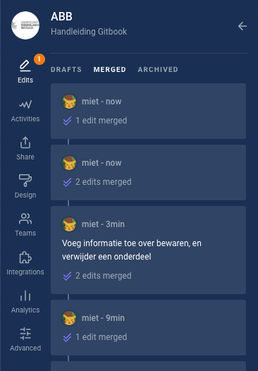
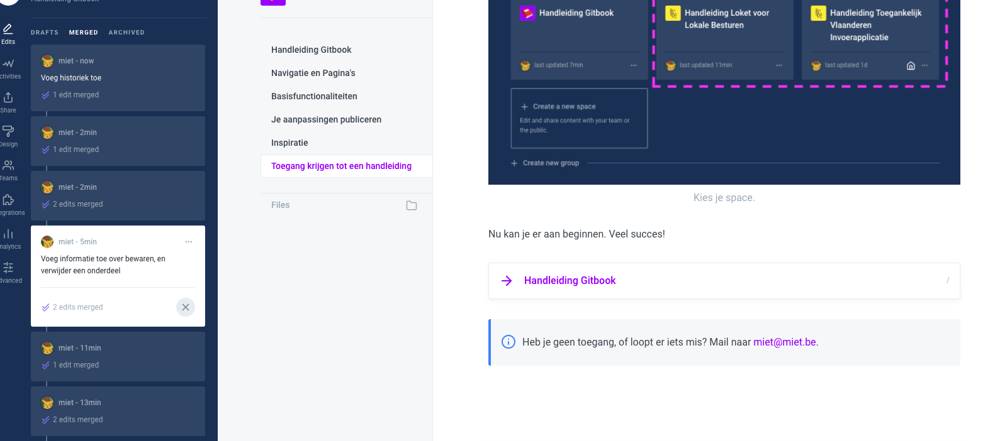
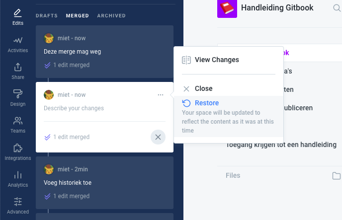
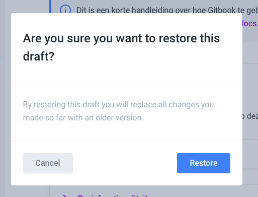
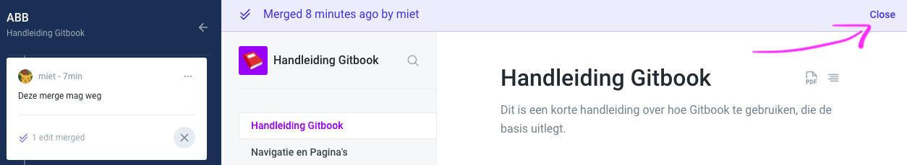

# Historiek bekijken en herstellen

## Een vorige versie bekijken

Heb je per ongeluk iets weggedaan uit het verleden, en wil je het terug? Ga naar "edits" en ga op zoek naar de _merge_ die je laatst hebt gedaan.

Klik vervolgens op die _merge_; je kan de informatie nu kopiëren.

## Een vorige versie terugzetten

Je kan er ook voor kiezen om een vorige versie van je space terug te zetten. _**Opgelet! Gooi niet zomaar informatie van anderen weg. Deze informatie krijg je niet meer terug.**_

## Weer naar je laatste versie terugkeren

Om weer naar je laatste aanpassingen terug te keren, **klik rechtsboven op close**.

