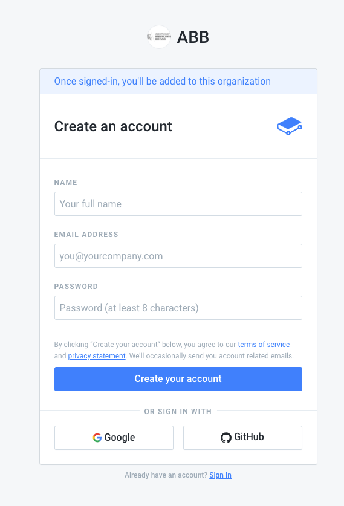

# Toegang krijgen tot een handleiding

## Registratie


Je kan momenteel een invite krijgen via [miet@miet.be](mailto:miet@miet.be). Geen invite gekregen? Stuur een mailtje!


Via de invite link kan je ervoor kiezen om een nieuwe account aan te maken, of je bestaande Github of Google account gebruiken.

## Jouw organisatie en _space_ vinden

Vervolgens krijg je een overzicht van je verschillende organisaties, die van ons heet ABB-Vlaanderen. Je kan ook je eigen organisaties gebruiken om experimenten mee te doen.

Vervolgens kies je de handleiding voor het product dat je wil aanpassen; die zitten onder _Spaces_. Je kan eens gaan spieken bij de anderen, maar gelieve hier niets aan te passen.

Nu kan je er aan beginnen. Veel succes!




Heb je geen toegang, of loopt er iets mis? Mail naar [miet@miet.be](mailto:miet@miet.be).


