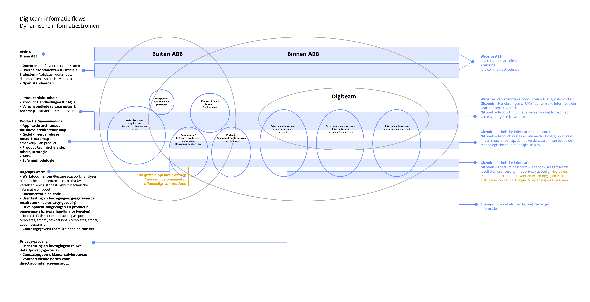

# Zet je eigen Gitbook omgeving op

## \[`in progress]` Wat we aanbieden voor het Digiteam 

### Uniforme URL's

**Voorbeeld**  
[abb-vlaanderen.gitbook.io/handleiding-toegankelijk-vlaanderen-invoerapp](https://abb-vlaanderen.gitbook.io/handleiding-toegankelijk-vlaanderen-invoerapp/)  
doc.toegankelijk.lblod.info \[in progress\]  
doc.toegankelijk.vlaanderen.be \[doel, na overleg\]

### Huidige informatiestormen

#### Publieke informatie voor ambtenaren in lokale besturen

Deze omgeving is toegankelijk voor gebruikers van de applicatie, die informatie willen zoals **handleidingen** en eventueel **release notes**. **Waarom** de applicatie bestaat, voor welke **doeleinden** kan ook op deze pagina terecht komen.

Deze gebruikersgroep is niet dicht betrokken bij het ontwikkelen van de producten.  
  
Voorbeelden, nog gelijk te trekken:  
- [https://abb-vlaanderen.gitbook.io/gelinkt-notuleren-handleiding](https://abb-vlaanderen.gitbook.io/gelinkt-notuleren-handleiding)  
- [https://abb-vlaanderen.gitbook.io/handleiding-toegankelijk-vlaanderen-invoerapp](https://abb-vlaanderen.gitbook.io/handleiding-toegankelijk-vlaanderen-invoerapp)

#### Specialistische, publieke informatie voor betrokken partijen

Deze omgeving focust zich op het delen van informatie die helpt om de applicaties mee te bouwen.  
  
Voorbeelden, nog gelijk te trekken:  
- [https://abb-vlaanderen.gitbook.io/feature-passports-lblod](https://abb-vlaanderen.gitbook.io/feature-passports-lblod)

#### \[to be discussed – Sharepoint?\] Digiteam Wiki

Delen van gestructureerde informatie \(≠ documenten\) voor teamleden in het Digiteam; waar informatie in zit die in een later stadium gedeeld kan worden.

Voorbeeld private, to be discussed:  
[https://app.gitbook.com/@abb-vlaanderen/s/wiki-lblod-digiteam/](https://app.gitbook.com/@abb-vlaanderen/s/wiki-lblod-digiteam/)

#### Gedeelde team informatie, ook voor toekomstige collega's

Tooling, producten, architectuur, ...



#### Gevoelige informatie

Hoort thuis op de prive Sharepoint.

#### Juridische achtergrond per applicatie

 Hoort thuis op [https://lokaalbestuur.vlaanderen.be/](https://lokaalbestuur.vlaanderen.be/).


**Meer informatie te delen, maar geen plek?**  
Neem contact op met Miet.


### Uniforme URL's

**Voorbeeld**  
[abb-vlaanderen.gitbook.io/handleiding-toegankelijk-vlaanderen-invoerapp](https://abb-vlaanderen.gitbook.io/handleiding-toegankelijk-vlaanderen-invoerapp/)  
doc.toegankelijk.lblod.info \[in progress\]  
doc.toegankelijk.vlaanderen.be \[doel, na overleg\]

#### Vraagstuk; hoe dit te rijmen met verschillende informatiestromen?

* vb. doc.toegankelijk.vlaanderen.be
  * alles op "doc" link zetten: niet altijd relevant om al die informatie te delen?
  * handleidingen VS feature passports, doelpubliek nood aan al die informatie op een plek?
* vb. doc.toegankelijk.vlaanderen.be + doc.toegankelijk.vlaanderen.be
  * voor elke nood een aparte domeinnaam; veel werk, veel te schalen op dommeinnaam
  * kan dit opgevangen worden in de structuur ipv de domeinnaam?
  * Is het nodig om al de domeinnamen te splitsen?

## 

