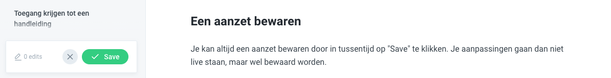
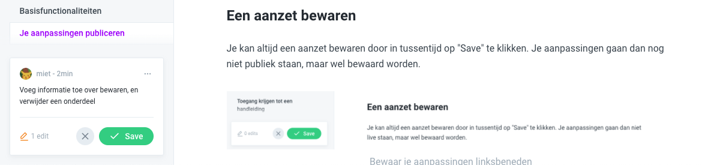
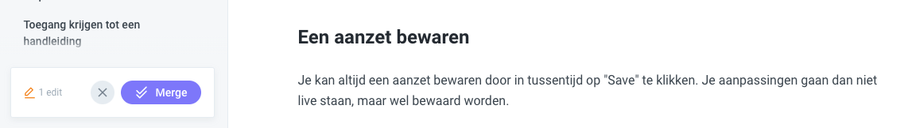

# Je aanpassingen publiceren


Bewaar en publiceer \(merge\) zo vaak mogelijk! Je changes gaan niet verloren als je even inactief bent, maar _**het is mogelijk dat anderen ook aanpassingen doen**_.


## Een aanzet bewaren

Je kan altijd een aanzet bewaren door in tussentijd op "Save" te klikken. Je aanpassingen gaan dan nog niet publiek staan, maar wel bewaard worden.

Je ziet dan ook ineens hoe veel aanpassingen je hebt gedaan, en krijgt de optie om je aanpassingen te beschrijven. Dat is handig als je later wil ontdekken wat je ook alweer allemaal hebt gedaan.

## Je aanpassingen publiceren of _mergen_

Om je aanpassingen publiek te maken en samen te voegen met de aanpassingen die anderen hebben doorgevoerd, klik op "merge".

Dat zorgt ervoor dat al de aanpassingen die je voorheen hebt bewaard gebundeld online worden gezet.


Heb je een "_merge conflict_", en geraak je er niet uit? Neem contact op met [miet@miet.be](mailto:miet@miet.be)


#### Informatie kwijt? Kijk naar je historiek.



## Welke link deel ik aan mijn publiek?

### Handleiding Gelinkt Notuleren



### Handleiding Toegankelijk Vlaanderen Invoerapplicatie



### Handleiding loket voor lokale besturen



### Handleiding Appuniversum



