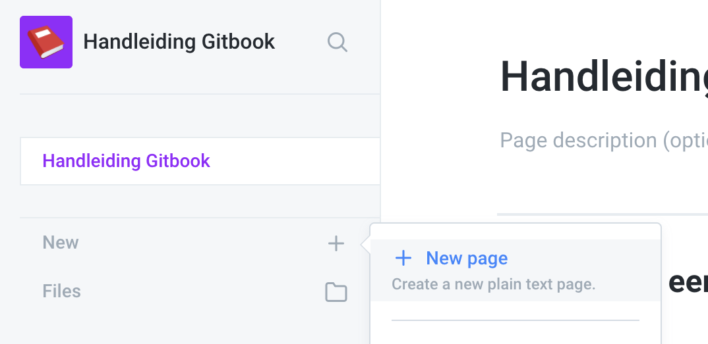
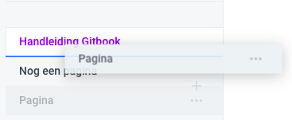
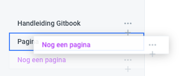

# Navigatie en Pagina's

## Nieuwe pagina aanmaken

Je kan een nieuwe pagina aanmaken, via de "new" knop of...

 ...via het plusje wanneer je hovered onder een navigatie element.

## Pagina's ordenen

Het is eenvoudig om de hiërarchie van pagina's aan te passen door de pagina's te slepen.

Verander ze van volgorde:

Of maak er een subpagina van:

## 

